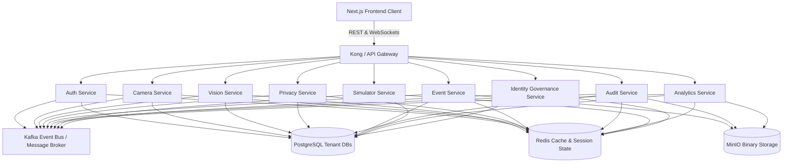
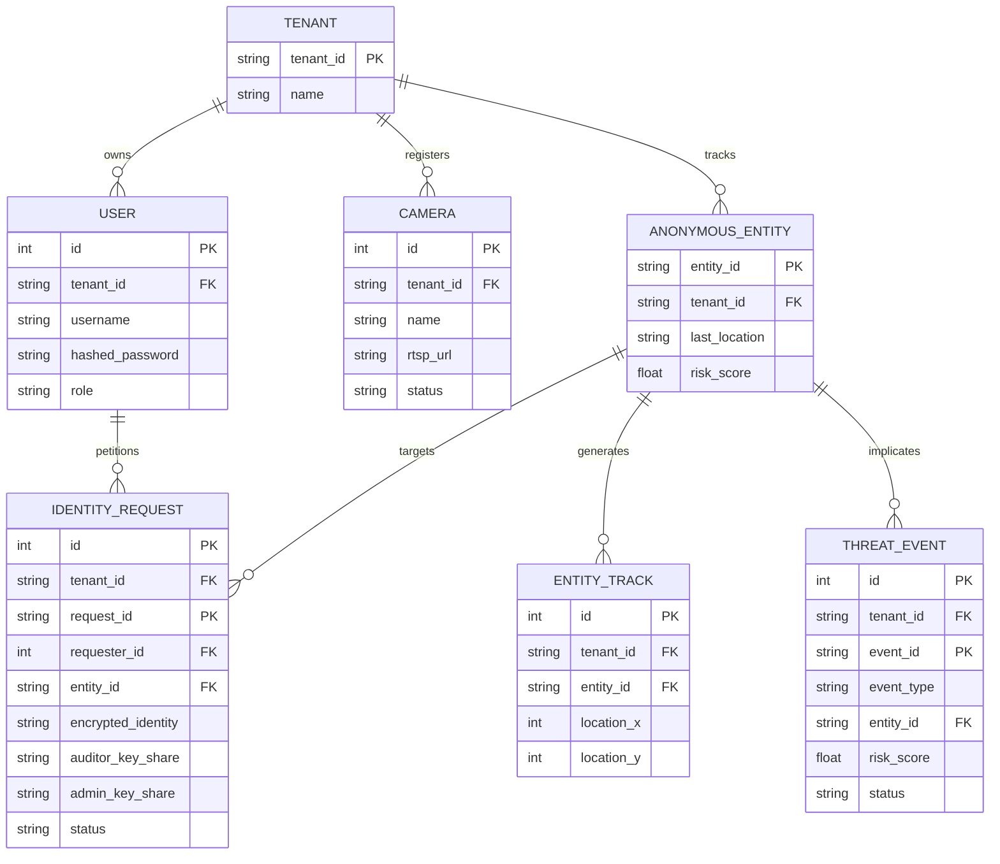
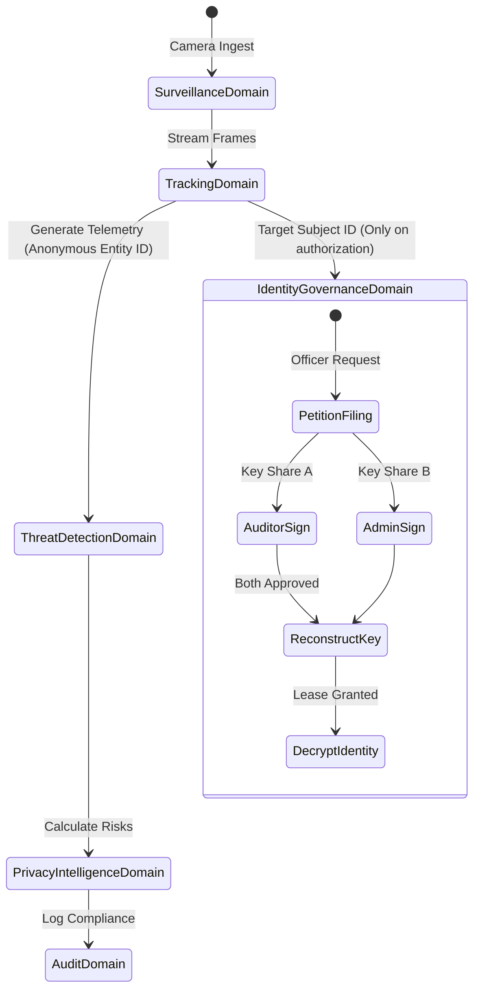

# BlindWatch AI: Production-Grade System Architecture Design

This document details the refactored, multi-tenant modular architecture of BlindWatch AI, transitioning from a monolithic application into a domain-driven microservices platform.

---

## 1. Full System Architecture

BlindWatch AI is structured as a distributed microservice network coordinate system. The frontend Next.js client interacts with API gateways that route calls to individual isolated services, while heavy frame telemetry is communicated via high-throughput message buses.



---

## 2. Service Architecture

Each service operates in a shared-nothing boundary, exposing a private database context and communicating asynchronously through Pydantic event schemas.

| Service | Primary Responsibility | Data Store Ownership | Key Abstractions |
| :--- | :--- | :--- | :--- |
| **Auth Service** | Authentication, JWT management, RBAC enforcement | PostgreSQL (`users`, `roles`, `permissions`, `sessions`) | User, Role, Permission |
| **Camera Service** | Camera nodes setup, RTSP configuration, health telemetry | PostgreSQL (`cameras`, `camera_groups`, `camera_status`) | Camera, CameraGroup |
| **Vision Service** | Frame analysis, YOLO tracking, face coordinates isolation | PostgreSQL (`vision_jobs`, `detections`, `entity_tracks`), Redis (coordinates) | VisionJob, Detection, EntityTrack |
| **Privacy Service** | Dynamic masking, privacy score calculation, CCPA rules | PostgreSQL (`privacy_scores`, `compliance_rules`, `privacy_events`) | PrivacyScore, ComplianceRule |
| **Event Service** | Anomaly classification, timeline tracking, evidence | PostgreSQL (`events`, `event_evidence`, `event_timelines`), MinIO (snapshots) | ThreatEvent, ThreatEvidence |
| **Audit Service** | Cryptographic ledger, transaction history, session checks | PostgreSQL (`audit_logs`, `audit_sessions`, `approval_history`) | AuditLog, AuditSession |
| **Analytics Service**| Trend compilation, camera efficiency indexing | PostgreSQL (`analytics_snapshots`, `trend_reports`) | AnalyticsSnapshot, TrendReport |
| **Simulator Service**| Privacy vs safety simulation, hypothetical scoring | PostgreSQL (`simulation_runs`, `simulation_results`) | SimulationRun, SimulationResult |
| **Identity Gov** | Decryption petition review, dual-key XOR key management | PostgreSQL (`identity_requests`, `approvals`, `reveal_sessions`) | IdentityRequest, Approval |

---

## 3. Database Relationships

To maintain multi-tenant routing, every table is isolated with a indexed `tenant_id` column. Inside the SQL level, relationships link entities within the same tenant.



---

## 4. Domain Relationships

Domain boundaries dictate that **Identity Governance** is completely decoupled from standard visual ingestion. 표준 감시 및 실시간 추적 도메인은 오직 `entity_id`를 매개로만 협력합니다.



---

## 5. Event Architecture

Message broker events drive async workflows. Pydantic specifications define events exchanged over Kafka:

```
Camera Feed Ingest (RTSP)
    ↓
[Event: FrameReceived] (Surveillance Service)
    ↓
[Event: EntityDetected] (Vision Service -> payload: {entity_id, bounding_box, frame_id})
    ↓
[Event: TrackingUpdated] (Tracking Service -> updates Redis tracks)
    ↓
[Event: AnomalyClassified] (Threat Service -> payload: {event_type, risk_score})
    ↓
[Event: ComplianceIndexCalculated] (Privacy Service -> updates scores)
    ↓
[Event: AuditLogged] (Audit Service -> updates SHA-256 Chain)
```

---

## 6. Storage Architecture

Data classification mandates three specialized storage tiers:

1. **Transactional Data (PostgreSQL)**
   * User directory, credentials, camera indexes, threat profiles, and logs.
   * Row-level security (RLS) restricts database operations strictly to matches on the caller's JWT `tenant_id`.
2. **Active States (Redis Cluster)**
   * Live websocket locations, active user sessions, video chunk frames, and threat queues.
3. **Binary Assets (MinIO Object Storage)**
   * Encrypted evidence frames, security recordings clips, and exported reports.

---

## 7. WebSocket Architecture

WebSockets deliver real-time streams to the portal console:

* `/ws/live-feed`: Streams frame coordinates, active bounding boxes, and camera offline events.
* `/ws/alerts`: Streams security breaches and escalated threat events.
* `/ws/dashboard`: Streams real-time system safety metrics, privacy scores, and ledger updates.

---

## 8. Frontend Module Architecture

The Next.js client is refactored into modular components, isolating business logic from views:

```
src/
├── app/
│   ├── portal/
│   │   ├── monitoring/      # Camera grid, RTSP streams, feeds
│   │   ├── events/          # AI alerts, explaining reasoning
│   │   ├── privacy/         # Transparency metrics, retention scope
│   │   ├── simulator/       # Policies modeling, sandboxed run
│   │   └── audit/           # Cryptographic chain verify dashboard
├── components/              # Shared UI components
├── config.ts                # API endpoint mappings
└── hooks/                   # Custom fetching and WS streams
```

---

## 9. Core Product Rule: Zero-Knowledge Identity Governance

The design strictly enforces: **Identity Is A Privileged Resource, Not Standard Data.**

* Standard tracking datasets only ever reference the hashed `entity_id` (e.g. `Entity_2B8C`).
* The biological details (name, SSN, or clearance) are stored in an encrypted block.
* Keys are sharded as XOR shares across Admin and Auditor accounts. Decryption is only possible during an active, dual-signed lease window.

---

## 10. Volume 2: Complete Database Design (PostgreSQL)

This section outlines the production-ready PostgreSQL relational schema layout designed for high scalability (up to 10,000 cameras and 1 million daily events).

### Database Rules
* **Primary Keys**: Every table uses a globally unique `UUID` as its primary identifier.
* **Audit Columns**: Every table contains `created_at TIMESTAMP` and `updated_at TIMESTAMP` tracking fields.
* **Multi-Tenancy**: Every table is partitioned or filtered via a required `tenant_id UUID` column.
* **Soft Delete**: Critical operational directories (`users`, `cameras`, `events`, `identity_requests`, `anonymous_entities`) include `is_deleted BOOLEAN` fields.

```mermaid
erDiagram
    users {
        uuid id PK
        uuid tenant_id
        varchar email UNIQUE
        varchar username
        text password_hash
        varchar full_name
        varchar phone
        uuid role_id FK
        varchar status
        boolean mfa_enabled
        timestamp last_login
        timestamp created_at
        timestamp updated_at
        boolean is_deleted
    }
    roles {
        uuid id PK
        varchar name
        text description
        timestamp created_at
    }
    permissions {
        uuid id PK
        varchar permission_key UNIQUE
        text description
        timestamp created_at
    }
    role_permissions {
        uuid id PK
        uuid role_id FK
        uuid permission_id FK
    }
    cameras {
        uuid id PK
        uuid tenant_id
        varchar name
        varchar location
        varchar camera_type
        text stream_url
        varchar status
        float health_score
        timestamp last_heartbeat
        timestamp created_at
        timestamp updated_at
        boolean is_deleted
    }
    anonymous_entities {
        uuid id PK
        uuid tenant_id
        text entity_hash UNIQUE
        timestamp first_seen
        timestamp last_seen
        uuid camera_id FK
        varchar status
        float behavior_score
        float risk_score
        timestamp created_at
        timestamp updated_at
        boolean is_deleted
    }
    events {
        uuid id PK
        uuid tenant_id
        varchar event_type
        uuid camera_id FK
        uuid entity_id FK
        float risk_score
        float confidence
        varchar severity
        varchar status
        timestamp created_at
        timestamp updated_at
        boolean is_deleted
    }
    identity_requests {
        uuid id PK
        uuid tenant_id
        uuid event_id FK
        uuid requester_id FK
        text justification
        varchar case_number
        varchar status
        timestamp requested_at
        timestamp created_at
        timestamp updated_at
        boolean is_deleted
    }
    
    users ||--o{ identity_requests : "requests"
    roles ||--o{ users : "assigns"
    roles ||--|{ role_permissions : "contains"
    permissions ||--|{ role_permissions : "granted-to"
    cameras ||--o{ anonymous_entities : "detects"
    anonymous_entities ||--o{ events : "generates"
    events ||--o{ identity_requests : "escalates"
```

### Table Definitions

#### 1. Identity & Role Governance
* **`users`**: Main user catalog. Soft delete enabled.
* **`roles`**: System roles (e.g. `admin`, `auditor`, `officer`, `viewer`).
* **`permissions`**: Access key descriptors (e.g., `camera.read`, `identity.reveal`).
* **`role_permissions`**: Joins roles to specific permission keys.

#### 2. Surveillance & Camera Nodes
* **`cameras`**: Camera catalog (type options: `WEBCAM`, `RTSP`, `VIDEO_UPLOAD`). Soft delete enabled.
* **`camera_groups`**: Organizational groups of cameras.
* **`camera_group_members`**: Mapping table linking cameras to groups.

#### 3. Vision tracking & Detections
* **`anonymous_entities`**: Subject directory. Zero identity data stored. Soft delete enabled.
* **`behavior_signatures`**: Detailed movement and behavior telemetry signatures in JSONB format.
* **`detections`**: Raw YOLO bounding-box telemetry.

#### 4. Anomaly & Event Processing
* **`events`**: Alerts list (type options: `THEFT`, `INTRUSION`, `WEAPON`, `FIRE`, `PANIC`, `VIOLENCE`, `MEDICAL`). Soft delete enabled.
* **`event_timelines`**: Historical frame step tracking for events.
* **`event_evidence`**: Files containing evidence (image, video, report).
* **`event_explanations`**: Explainable AI weights and textual decision tree reasons.

#### 5. Privacy Intelligence
* **`privacy_scores`**: Calculated compliance metrics over time.
* **`compliance_rules`**: Legal or policy constraint parameters.
* **`exposure_risks`**: Flagged vulnerabilities and privacy leakage alerts.

#### 6. Identity Decryption Governance
* **`identity_requests`**: Petitions for temporary identity decryptions. Soft delete enabled.
* **`approvals`**: Multi-signature decision blocks.
* **`identity_reveal_sessions`**: Reveal lease windows and temporary decryptions.

#### 7. Audit & Logs
* **`audit_logs`**: System audit logs ledger.

#### 8. Analytics & Reporting
* **`analytics_snapshots`**: Aggregated day snapshots.
* **`threat_trends`**: Trend statistics.
* **`reports`**: Compilation PDF/CSV files list. Soft delete enabled.

#### 9. Simulator Sandbox
* **`simulation_runs`**: Sandbox runs metadata.
* **`simulation_results`**: Comparative performance indicators.

#### 10. Alerts & Notifications
* **`notifications`**: Live alert banners push notifications.

### Performance Database Indexes
```sql
CREATE INDEX idx_events_created_at ON events(created_at DESC);
CREATE INDEX idx_events_event_type ON events(event_type);
CREATE INDEX idx_anon_entity_hash ON anonymous_entities(entity_hash);
CREATE INDEX idx_audit_timestamp ON audit_logs(timestamp DESC);
CREATE INDEX idx_ident_req_status ON identity_requests(status);
CREATE INDEX idx_priv_score_calc ON privacy_scores(calculated_at DESC);
```

---

## 11. Volume 3: Complete REST API Specification + Button Mappings

This section details the REST API endpoints and direct user interface button mappings across the BlindWatch modular microservices, adhering strictly to versioned paths, audit logging, and role-based policies.

### API Gateway / Routing Rules
* Prefix format: `/api/v1/`
* Security: Validated JWT + Role Permissions.
* Audit Trails: Write operations automatically log to `audit_logs` before returning the HTTP response.

### 1. Authentication & Security Endpoints
* **`POST /api/v1/auth/login`**: Authenticate credentials, log session, and issue JWT token.
  * **Button Mapping**: `Login` Button
* **`POST /api/v1/auth/refresh`**: Refresh expired JWT token using the refresh token.
* **`POST /api/v1/auth/logout`**: Terminate session, invalidate JWT, and record audit log.

### 2. User Management Endpoints (Admin Only)
* **`GET /api/v1/users`**: List all users within the tenant.
* **`POST /api/v1/users`**: Create a new tenant user. Records audit log.
* **`PUT /api/v1/users/{id}`**: Update user details.
* **`DELETE /api/v1/users/{id}`**: Soft-delete a user record (`is_deleted = true`).

### 3. Camera Node Governance Endpoints
* **`POST /api/v1/cameras`**: Register a new camera node. Launches corresponding vision track job.
  * **Button Mapping**: `Add Camera` Button
* **`GET /api/v1/cameras`**: Fetch all cameras for the current tenant.
* **`GET /api/v1/cameras/{id}`**: Fetch details of a single camera.
* **`PUT /api/v1/cameras/{id}`**: Edit stream configuration or settings.
* **`DELETE /api/v1/cameras/{id}`**: Delete camera node.
* **`POST /api/v1/cameras/{id}/test`**: Validate RTSP connection status.
  * **Button Mapping**: `Test Connection` Button

### 4. Live Vision Feeds
* **`GET /api/v1/live-feed/{camera_id}`**: Restructure stream frames for HTTP stream preview.
* **`WS /ws/live-feed/{camera_id}`**: Push real-time base64 frame stream and bounding-box telemetries.
  * **Button Mapping**: `Pause Feed` / `Resume Feed` / `Fullscreen Feed` (handled frontend-side)

### 5. Entity Surveillance Profiles
* **`GET /api/v1/entities`**: List tracked anonymous entities and current risk ratings.
* **`GET /api/v1/entities/{id}`**: Fetch behavior metrics, movement path history, and risk trends.

### 6. Threat Event Lifecycle
* **`GET /api/v1/events`**: Fetch anomaly alerts. Filters: `status`, `severity`, `event_type`, `date`.
* **`GET /api/v1/events/{id}`**: Fetch full event parameters.
* **`POST /api/v1/events/{id}/escalate`**: Move event into active supervisor escalation queues.
  * **Button Mapping**: `Escalate` Button
* **`POST /api/v1/events/{id}/dismiss`**: Set event status to `DISMISSED` (false positive).
  * **Button Mapping**: `Dismiss` Button

### 7. AI Explanations & Evidence
* **`GET /api/v1/events/{id}/evidence`**: Retrieve evidentiary frame snapshots or short video loops.
  * **Button Mapping**: `View Evidence` Button
* **`GET /api/v1/evidence/{id}/download`**: Direct download link to original evidence attachment file.
* **`GET /api/v1/events/{id}/explanation`**: Fetch XAI decision rationale and weights.
  * **Button Mapping**: `Explain Decision` Button

### 8. Privacy Dashboards & Audits
* **`GET /api/v1/privacy/dashboard`**: Fetch compliance posture score and active data leaks status.
* **`POST /api/v1/privacy/assessment`**: Trigger dynamic GDPR/CCPA automated rules check.
  * **Button Mapping**: `Run Assessment` Button
* **`GET /api/v1/privacy/exposure-risks`**: Fetch list of currently flagged tracking risks.
* **`GET /api/v1/privacy/compliance`**: Query active regulation constraints config.

### 9. Identity Reveal Approval Workflows
* **`POST /api/v1/identity-requests`**: File request for temporary zero-knowledge key decryption.
  * **Button Mapping**: `Request Identity` Button
* **`GET /api/v1/identity-requests`**: Retrieve current reveal petitions history.
* **`POST /api/v1/identity-requests/{id}/auditor-approve`**: Record first-signature approval.
  * **Button Mapping**: `Approve` (Auditor Screen) Button
* **`POST /api/v1/identity-requests/{id}/auditor-reject`**: Record auditor rejection.
* **`POST /api/v1/identity-requests/{id}/admin-approve`**: Record second-signature approval.

### 10. Audit Trails & Logs Ledger
* **`GET /api/v1/audit/logs`**: Query ledger database logs. Filters: `user`, `action`, `date`.
* **`GET /api/v1/audit/logs/{id}`**: View detailed payload block of single audit transaction.

### 11. Dashboard Analytics & Trends
* **`GET /api/v1/analytics/dashboard`**: Consolidated metrics.
* **`GET /api/v1/analytics/threat-trends`**: Chronological trend mappings.
* **`GET /api/v1/analytics/camera-effectiveness`**: Camera performance comparison indexes.
* **`GET /api/v1/analytics/privacy-trends`**: History of calculated compliance scores.
* **`GET /api/v1/analytics/heatmaps`**: Coordinate dwell-time visual arrays.

### 12. Simulator Sandbox
* **`POST /api/v1/simulator/run`**: Trigger simulator run config.
  * **Button Mapping**: `Run Simulation` Button
* **`GET /api/v1/simulator/history`**: Get prior run results comparisons.
* **`GET /api/v1/simulator/{id}`**: Retrieve full details of simulator run parameters and scores.

### 13. Reports Generator
* **`POST /api/v1/reports/generate`**: Trigger compilation PDF/CSV report generation.
  * **Button Mapping**: `Generate Report` Button
* **`GET /api/v1/reports/{id}/download`**: Retrieve compiled PDF report output.

### 14. Real-Time Push Notifications
* **`GET /api/v1/notifications`**: Query unread status logs.
* **`POST /api/v1/notifications/{id}/read`**: Mark message as read.

### 15. WebSocket Channels
* **`WS /ws/dashboard`**: Broad updates.
* **`WS /ws/alerts`**: Push urgent alerts.
* **`WS /ws/live-feed`**: Bounding box coordinates.

